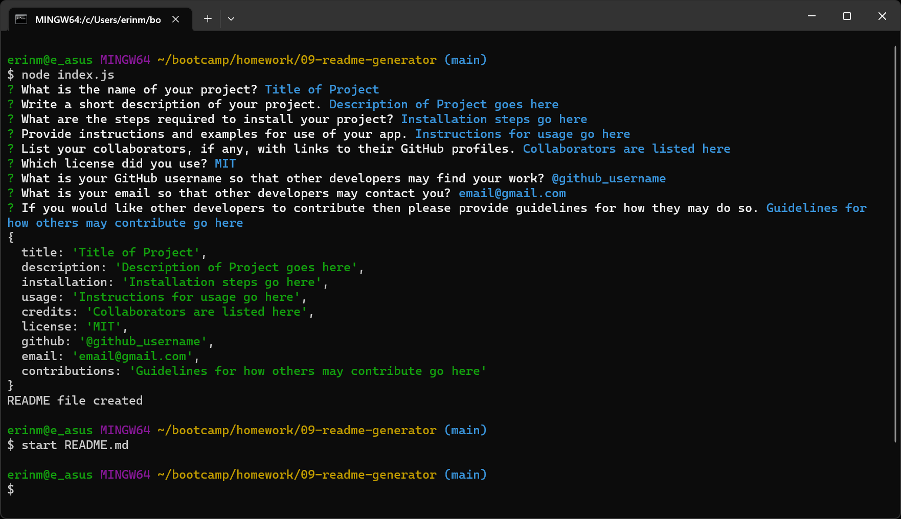

# CLI README Generator 

  ## Description
  This CLI application creates high quality readme markdown files for development projects.
  ## Credits
  Functions for renderLicenseLink, renderLicenseBadge, and renderLicenseSection were provided by TA Paul Cwik.
  ## Usage
  Run 'node index.js' in the terminal and answer the prompts to generate a README.md file (shown below)

  
